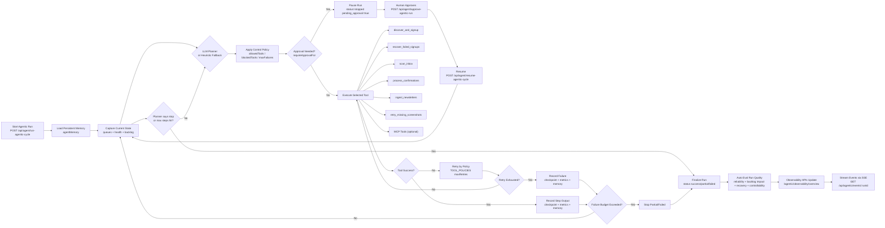

# Agent Flow Diagram

## Quick Readout (Plain English)

1. Agent starts and loads memory from past runs.
2. It checks current backlog and health.
3. Planner picks the next best tool.
4. Policy gates can pause for human approval before risky tools.
5. Tool runs with retries, then results are saved.
6. Failed signup brands are automatically sent into recovery flow.
7. Loop repeats until stop condition or max steps.
8. Run gets evaluated and surfaced in observability dashboards.
