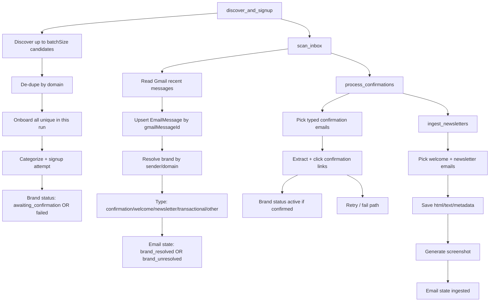

# Brand Onboarding Agent Workflow

## End-to-End Flow

## Batch Size Behavior

- Discovery targets `batchSize` candidates.
- After dedupe, the run onboards all unique candidates from that discovered set.
- There is no extra `*2` expansion and no truncation to first N after dedupe.
- By default discovery source is `ollama` (set via `DISCOVERY_SOURCE`).
- LLM discovery stores domain history in Mongo key `llm_discovery_domains` (legacy key `claude_discovery_domains` is still read).

## Brand Status Definitions

- `discovered`: Candidate identified but no signup started.
- `subscribing`: Signup automation currently in progress.
- `submitted`: Form was submitted (legacy/optional transitional state).
- `awaiting_confirmation`: Waiting for confirmation/welcome/newsletter email.
- `confirmed`: Confirmation click succeeded (transitional; typically moves to active).
- `active`: Brand is considered onboarded and receiving newsletters.
- `failed`: Signup/confirmation failed or timed out.
- `captcha_blocked`: Bot protection blocked automation.
- `stale`: Previously active but no relevant email seen in staleness window.
- `duplicate`: Candidate rejected due duplicate domain/brand match.
- `skipped`: Manually skipped/removed.

## Manual (Cowork) Signup Normalization

- If a brand was `failed` or `captcha_blocked` and a `welcome` email arrives, the inbox worker moves it to `awaiting_confirmation`.
- If a `confirmation` email arrives, the inbox worker marks `confirmationRequired=true` and keeps/moves brand in `awaiting_confirmation`.
- If a `newsletter` email arrives, the inbox worker promotes the brand to `active` (subscription proven live), even if previous status was `failed` or `captcha_blocked`.
- Confirmation processor now auto-resolves missing `brandId` by sender/domain and can continue confirmation clicks for manually signed-up brands.
- If welcome/newsletter cannot be directly mapped by sender address, inbox resolver uses domain mentions + brand phrases in email content to infer the correct failed/captcha brand with confidence scoring.
- Trusted welcome proof (brand-domain match or high-confidence content reference) now marks brand `active` in the next run, so cowork/manual signups continue automatically.

This means cowork/manual signups are automatically regularized into the same downstream workflow once inbound email evidence appears.

## Sender Identity Robustness

- Brand identity no longer depends only on exact sender email.
- Matching now uses a domain network approach:
  - exact sender email
  - known sender domains
  - registrable/root domain (example: `viori.com` and `e.viori.com` are treated as the same network)
  - fallback using meaningful link domains inside the email body
- Newsletter sender local-part changes (`support@`, `help@`, `no-reply@`) are handled without breaking brand continuity.

## Email Type Definitions

- `confirmation`: Asks user to confirm/verify subscription.
- `welcome`: First onboarding/welcome note.
- `newsletter`: Recurring marketing/editorial campaign email.
- `transactional`: Order/receipt/shipping/account/system messages.
- `other`: Non-newsletter content that does not match known patterns.
- `unknown`: Not yet classified.

## Where Artifacts and Logs Live

- Newsletter screenshots: `artifacts/newsletters/` (local filesystem of running service).
- Brand logos: `artifacts/logos/` (auto-fetched from brand website metadata/assets).
- Runtime logs: console + `logs/agent.log`.
- Persistent activity logs (Mongo): `activitylogs` collection (30-day TTL).
- Workflow step history (Mongo): `workflowruns` collection.
- Parsed emails and ingest states: `emailmessages` collection.

## Internal 10-Min Scheduler

- Internal scheduler is configured via env vars and runs inside the service process.
- Default interval is every 10 minutes.
- It continues when your laptop is off only if the service is deployed (Railway/VPS always-on process).
- If you run locally, scheduler stops when your local Node process stops.
- Each tick runs:
  1. `discover_and_signup`
  2. `scan_inbox`
  3. `process_confirmations`
  4. `ingest_newsletters`

### Config

- `INTERNAL_CRON_ENABLED=true`
- `INTERNAL_CRON_INTERVAL_MIN=10`
- `INTERNAL_CRON_INITIAL_DELAY_SEC=30`
- `INTERNAL_CRON_BATCH_SIZE=10`
- `INTERNAL_CRON_INBOX_HOURS=24`
- `INTERNAL_CRON_MAX_INBOX_RESULTS=100`
- `INTERNAL_CRON_STEP_LIMIT=50`

### Where To See It

- Dashboard: `Workflow Step History` panel.
- API: `GET /api/activity/workflow-runs?limit=120`
- API: `GET /api/activity/logs?limit=200` (look for `phase=scheduler`)
- Railway logs: lines starting with `[scheduler]`.

## Logo Enrichment

- On onboarding, if a brand has no `logoUrl`, agent attempts non-LLM logo discovery from website HTML:
  - `og:logo`, `og:image`, `twitter:image`, icon links, logo-like image elements, JSON-LD logo.
- Storage options:
  - `LOGO_STORAGE_PROVIDER=github` (recommended for persistence): uploads logo file to a GitHub repo path and stores CDN/public URL in `brand.logoUrl`.
  - `LOGO_STORAGE_PROVIDER=local`: stores file in `artifacts/logos/` (not durable across redeploys).
- For production permanence, use GitHub storage config env vars (`GITHUB_LOGO_OWNER`, `GITHUB_LOGO_REPO`, `GITHUB_LOGO_BRANCH`, `GITHUB_LOGO_PATH_PREFIX`, `GITHUB_LOGO_TOKEN`).
- Bulk backfill endpoint:
  - `POST /api/brands/logo-backfill` with optional body `{ "limit": 100, "force": false }`

## LLM Discovery Runtime Notes

- `DISCOVERY_SOURCE=ollama` (default): try Ollama LLM first, then fallback discovery.
- `DISCOVERY_SOURCE=ollama_only`: LLM only unless `DISCOVERY_STRICT_LLM=true`.
- `DISCOVERY_STRICT_LLM=false` (default): if LLM call fails, fallback discovery prevents cycle failure.
- Configure `OLLAMA_BASE_URL` and `OLLAMA_MODEL`.

## Discovery Pool (1000 Candidate Buffer)

- Discovery now supports a persistent Mongo pool of candidates (`discovery_candidates` collection).
- On each run, agent consumes next `batchSize` brands from this stored pool first.
- LLM calls are used to top up pool only when available queue drops below target.
- Default controls:
  - `DISCOVERY_POOL_ENABLED=true`
  - `DISCOVERY_POOL_TARGET_SIZE=1000`
  - `DISCOVERY_POOL_FILL_BATCH=12`
  - `DISCOVERY_POOL_MAX_CALLS_PER_RUN=3`
  - `DISCOVERY_POOL_REFILL_ON_EXHAUST=true`
  - `DISCOVERY_POOL_REFILL_BURST_MAX_CALLS=120`
  - `DISCOVERY_POOL_HIGH_QUALITY_ONLY=true`
- Exhaust behavior: if available pool drops below current run `batchSize`, agent triggers a burst refill aiming to add the next ~1000 candidates before continuing.
- Quality behavior: pool refill prompts prioritize premium/luxury/established brands first.
- API endpoints:
  - `GET /api/discovery/pool/stats`
  - `POST /api/discovery/pool/fill` (body: `targetSize`, `maxCalls`, `chunkSize`)
