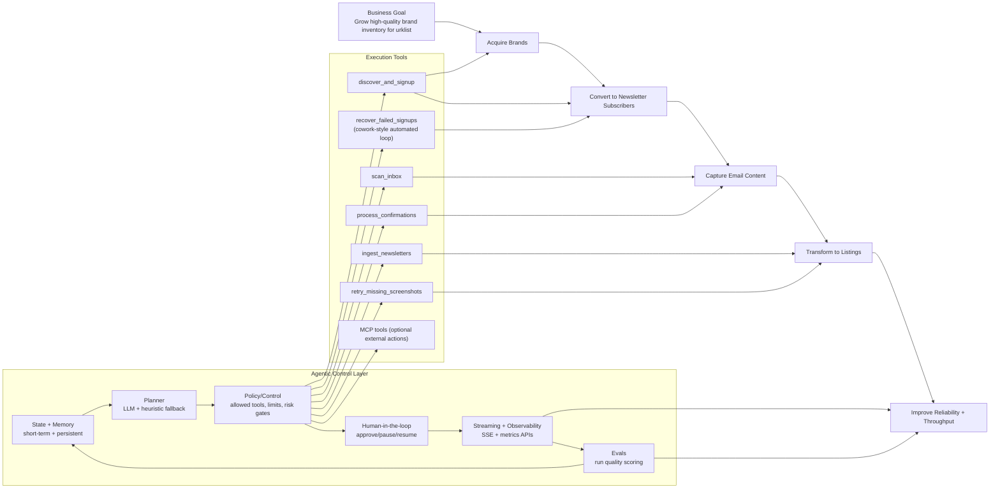

# Business + Agentic Graph

## How to read it

1. Top row is business value flow.
2. Middle row is agentic intelligence and governance.
3. Bottom row is concrete tools your runtime executes.
4. Arrows show how agentic controls drive tools, and tools drive business outcomes.
